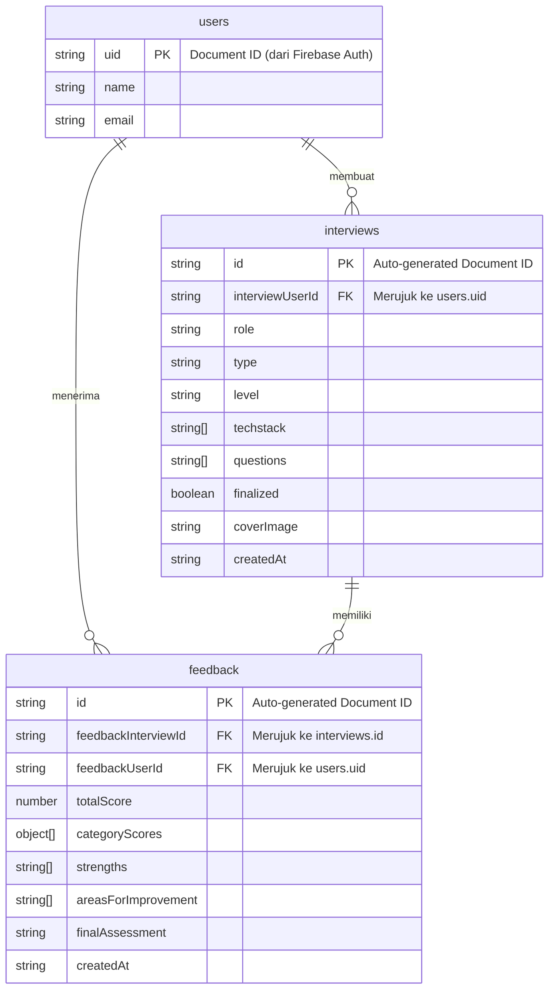

# Dokumentasi Skema Database Firestore

Berikut adalah dokumentasi lengkap skema database Firestore untuk proyek ini berdasarkan analisis *source code*:

---

## 1. Dokumentasi Collection

### ## Nama Collection: `users`

Menyimpan data profil dasar pengguna.

| Nama Field | Tipe Data | Nullable? | Deskripsi | Contoh Nilai | Referensi Baris Kode |
|---|---|---|---|---|---|
| `name` | string | No | Nama pengguna | `"Farid"` | `lib/actions/auth.action.ts:L22` |
| `email` | string | No | Email pengguna | `"farid@example.com"` | `lib/actions/auth.action.ts:L22` |

- **Document ID**: Custom ID, menggunakan `uid` dari Firebase Auth.
- **Relasi ke collection lain**: Tidak ada.
- **Index/Query pattern**:
  - `doc(uid).get()` (Query langsung menggunakan ID)
- **Siapa yang menulis (write)**: 
  - Fungsi `signUp` di `lib/actions/auth.action.ts`
- **Siapa yang membaca (read)**:
  - Fungsi `signUp` di `lib/actions/auth.action.ts` (pengecekan sebelum insert)
  - Fungsi `getCurrentUser` di `lib/actions/auth.action.ts`

---

### ## Nama Collection: `interviews`

Menyimpan data sesi simulasi wawancara yang di-generate.

| Nama Field | Tipe Data | Nullable? | Deskripsi | Contoh Nilai | Referensi Baris Kode |
|---|---|---|---|---|---|
| `role` | string | No | Peran/posisi pekerjaan | `"Frontend Developer"` | `app/api/vapi/generate/route.ts:L100` |
| `type` | string | No | Tipe interview | `"Technical"` | `app/api/vapi/generate/route.ts:L101` |
| `level` | string | No | Tingkat keahlian | `"Junior"` | `app/api/vapi/generate/route.ts:L102` |
| `techstack` | string[] | No | Daftar teknologi | `["React", "Next.js"]` | `app/api/vapi/generate/route.ts:L103` |
| `questions` | string[] | No | Pertanyaan hasil generate AI | `["What is React?"]` | `app/api/vapi/generate/route.ts:L106` |
| `interviewUserId` | string | No | Pembuat interview | `"abc123xyz"` | `app/api/vapi/generate/route.ts:L107` |
| `finalized` | boolean | No | Status interview | `true` | `app/api/vapi/generate/route.ts:L108` |
| `coverImage` | string | No | Path gambar cover | `"/spotify.png"` | `app/api/vapi/generate/route.ts:L109` |
| `createdAt` | string | No | Waktu pembuatan (ISO 8601) | `"2026-07-19T13:30:00Z"` | `app/api/vapi/generate/route.ts:L110` |

- **Document ID**: Auto-generated Firestore ID.
- **Relasi ke collection lain**: 
  - `interviewUserId` merujuk ke Document ID pada collection `users`.
- **Index/Query pattern**:
  - `where('interviewUserId', '==', userId).orderBy('createdAt', 'desc')`
  - `where('finalized', '==', true).where('interviewUserId', '==', userId).orderBy('createdAt', 'desc').limit(limit)`
  - `doc(id).get()`
- **Siapa yang menulis (write)**: 
  - `POST` endpoint di `app/api/vapi/generate/route.ts`
- **Siapa yang membaca (read)**:
  - Fungsi `getInterviewsByUserId`, `getLatestInterviews`, dan `getInterviewsById` di `lib/actions/general.action.ts`

---

### ## Nama Collection: `feedback`

Menyimpan hasil penilaian AI terhadap wawancara.

| Nama Field | Tipe Data | Nullable? | Deskripsi | Contoh Nilai | Referensi Baris Kode |
|---|---|---|---|---|---|
| `feedbackInterviewId` | string | No | ID interview terkait | `"xyz789"` | `lib/actions/general.action.ts:L93` |
| `feedbackUserId` | string | No | ID user terkait | `"abc123xyz"` | `lib/actions/general.action.ts:L94` |
| `totalScore` | number | No | Skor keseluruhan | `85` | `lib/actions/general.action.ts:L95` |
| `categoryScores` | object[] | No | Skor per kategori (sesuai `feedbackSchema`) | `[{ name: "Communication Skills", score: 90, comment: "Good" }]` | `lib/actions/general.action.ts:L96` |
| `strengths` | string[] | No | Poin kekuatan kandidat | `["Clear articulation"]` | `lib/actions/general.action.ts:L97` |
| `areasForImprovement` | string[] | No | Poin kelemahan | `["Lack of examples"]` | `lib/actions/general.action.ts:L98` |
| `finalAssessment` | string | No | Rangkuman penilaian | `"Overall a strong candidate"`| `lib/actions/general.action.ts:L99` |
| `createdAt` | string | No | Waktu pembuatan (ISO 8601) | `"2026-07-19T14:00:00Z"` | `lib/actions/general.action.ts:L100` |

- **Document ID**: Auto-generated Firestore ID.
- **Relasi ke collection lain**: 
  - `feedbackInterviewId` merujuk ke Document ID pada collection `interviews`.
  - `feedbackUserId` merujuk ke Document ID pada collection `users`.
- **Index/Query pattern**:
  - `where('feedbackInterviewId', '==', interviewId).where('feedbackUserId', '==', userId).limit(1)`
  - `where('feedbackInterviewId', '==', interviewId).where('feedbackUserId', '==', userId).orderBy('createdAt', 'asc').limitToLast(5)`
- **Siapa yang menulis (write)**: 
  - Fungsi `createFeedback` di `lib/actions/general.action.ts`
- **Siapa yang membaca (read)**:
  - Fungsi `getFeedbackByInterviewId` dan `getAllFeedbackByInterviewId` di `lib/actions/general.action.ts`

---

## 2. Diagram Relasi Antar Collection

Meskipun Firestore adalah NoSQL, relasi logisnya dapat digambarkan sebagai berikut:

---

## 3. Ringkasan Field Hantu / Liar

1. **Field Liar pada Collection `interviews`**: 
   - `coverImage`: Field ini disisipkan ke Firestore di `app/api/vapi/generate/route.ts:109`, namun **TIDAK DIDEFINISIKAN** dalam interface `Interview` di `types/index.d.ts`.
2. **Field Hantu / Runtime Computed pada antarmuka `Feedback`**: 
   - `attemptNumber`: Didefinisikan secara opsional (`attemptNumber?: number`) dalam interface `Feedback` di `types/index.d.ts`. Field ini tidak pernah disimpan di Firestore, tetapi **dikalkulasi secara dinamis/runtime** pada saat query di `getAllFeedbackByInterviewId` (`lib/actions/general.action.ts:154`) berdasarkan indeks array.

---

## 4. Catatan Konsistensi Tipe Data

- Secara umum tipe data sangat konsisten. 
- Tanggal (`createdAt`) di semua collection disimpan sebagai **String ISO 8601** (menggunakan `.toISOString()`), alih-alih tipe `Timestamp` asli milik Firestore. Definisi di TypeScript juga sesuai yaitu `string`.
- Objek `techstack` di `interviews` didefinisikan sebagai `string[]` dan secara konsisten diproses dengan `.split(",").map(s => s.trim())` sebelum di-insert jika input asalnya berupa string.
- Pada `categoryScores` di `feedback`, skema Zod `feedbackSchema` secara ketat mendefinisikan array berupa `z.tuple` dengan nama spesifik (`"Communication Skills"`, dll). Ini selaras dengan antarmuka TypeScript yang mendefinisikannya secara lebih longgar sebagai `Array<{ name: string; score: number; comment: string }>`, sehingga kompatibilitas tetap terjaga.
